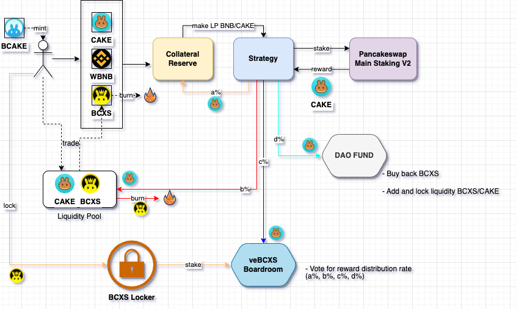

# BCake.Finance Contracts

Read full version [here](https://medium.com/@bcakefi/bcake-finance-the-first-ever-multi-collateral-stablecoin-on-bnb-chain-7e9c36f7ee00)

Inspired by FRAX’s design of a unique fractional-algorithmic stablecoin on Ethereum, today we want to introduce bCake Finance — the first partial-multi-collateralized & auto-yield-farming stablecoin which is built and supported on BNB Chain. We are aiming at creating an ecosystem that will allow more users to engage in profitable farming, effortlessly.

## bCake — the Multi Token System of $CAKE, $BNB, $BCAKE, and $BCXS

BCAKE (BNB Cake) is a stablecoin pegged around 1 CAKE, partially backed by multi collaterals: CAKE, BNB, and partially backed algorithmically by BCXS. The ratio of collateralized and algorithmic, the so-called Collateral Ratio (CR), depends on the market price of bCake.

The reason we choose CAKE as the primary collateral is that Pancake Finance is the number one platform on the BNB Chain. In addition, the liquidity of the CAKE/BNB pair is immense (728,000 BNB at the time of writing), bringing enormous opportunities for more utilities.

BCXS (BNB Cake Share) is the algorithmic token that accrues seigniorage revenue and excess collateral value.

The ratio of collateralized and algorithmic assets will depend on the market price of BCAKE. At Genesis, CR is 90% and the protocol adjusts the collateral ratio once every 2 hours by a step of 0.25%.

When BCAKE is at or above 1 CAKE, meaning the market’s demand for BCAKE is high, the system should be in de-collateralize mode by decreasing the collateral ratio, to a minimum of 80%. When the price of BCAKE is below 1 CAKE, the function increases the collateral ratio, maximum to 95%.

Users can use a combination of BNB and CAKE (each 50 percent) and BCXS, according to Collateral Ratio, to mint BCAKE. The collateral Ratio ranges from 95% Max to 80% Min, depending on BCAKE price. For example, with a Collateral Ratio of 90%, to mint 100 BCAKE, users will need 45 CAKE, 45 CAKE equivalent amount of WBNB, and 10 CAKE equal amount of BCXS. There is a minting fee (0.2% or 0.4%), charged in BCXS.

Reversely, holders can redeem BCAKE back to collaterals of BNB, CAKE, and BCXS. There is a redeeming fee (0.4% or 0.8%), also charged in BCXS.

## bCake advancements

The previous purely algorithmic protocols such as BasisCash, ESD, Tomb, and others provide a very noble solution to establish stablecoins with no backed assets. The issue with purely algorithmic protocols is their inability to efficiently react to volatility, which results in many of these “algo-stables” ending up in a dead zone and away from the $1 peg.‌

bCake.finance was born to solve the need for a genuine stablecoin and fix the failure of other previous protocols with 4 major improvements:
- Multi collateral system with stability mechanism
- Double ratios for minting/redeeming
- Bank run fixing
- Auto yield farming rewards

## Economic Flow Chart

